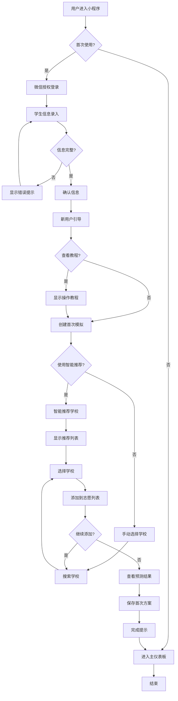
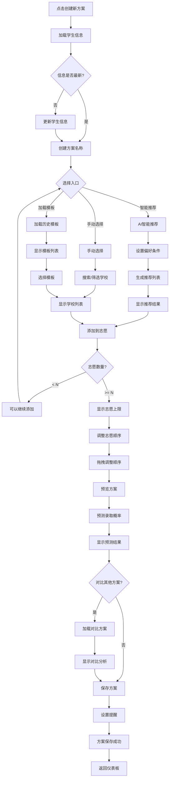
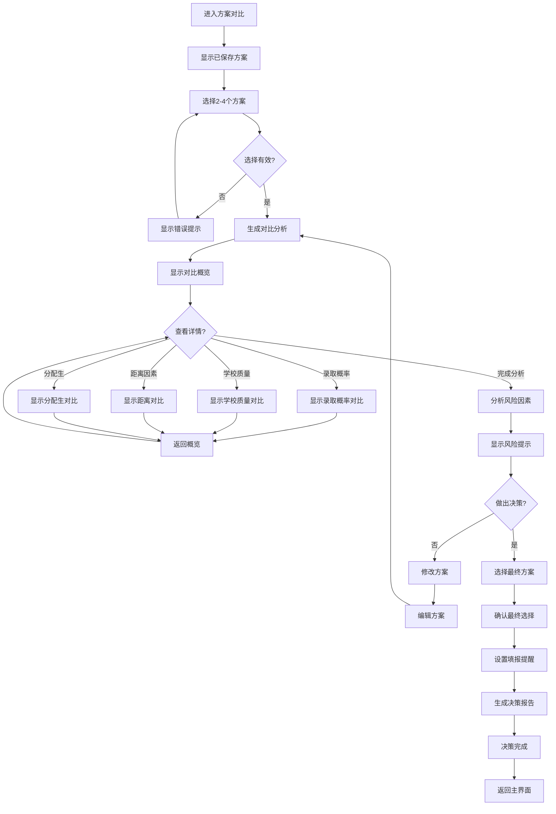
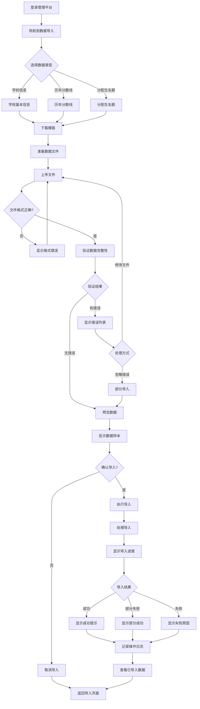

# UX Design Specification chapt003

**Author:** chb81
**Date:** 2026-04-11

---

## Executive Summary

### Project Vision

中考志愿填报系统是一个面向考生家长的智能决策支持平台，通过实时模拟填报、多维度学校分析和科学决策依据，帮助家长从"凭感觉填"转变为"凭数据填"，从"担心填错"转变为"有信心填"。

核心价值主张：不仅是决策工具，更是全程陪伴的数字伙伴，通过透明度+可追溯性+持续验证建立可信赖的决策支持关系。

### Target Users

**主要用户群体：**
- **身份**：面临中考志愿填报决策的考生家长
- **技术熟练度**：低 - 会用微信、会用小程序，对其他互联网应用了解甚少
- **心理状态**：焦虑型家长，对分配生/指标生政策不熟悉，担心择校错误
- **使用场景**：中考前需要做出关键教育决策的时期

**用户特征：**
- 对复杂技术概念理解困难
- 习惯微信的交互方式
- 需要明确的引导和指引
- 情感上需要支持和安慰
- 决策压力大，希望获得可靠的依据

### Key Design Challenges

**1. 复杂概念简化**
- **挑战**：分配生/指标生政策非常复杂，用户技术背景有限
- **影响**：需要将复杂的政策规则转化为简单易懂的可视化内容
- **设计考虑**：使用图形化解释、动画演示、分步引导

**2. 多端一致性但差异化**
- **挑战**：支持 5 个端（PC Web、管理平台、微信小程序、公众号、H5），用户只熟悉微信
- **影响**：微信小程序应该是主要入口，其他端需要提供无缝衔接的体验
- **设计考虑**：以小程序为核心设计，其他端保持一致性但可以提供更多深度功能

**3. 数据可视化易懂性**
- **挑战**：需要展示历年录取数据、概率预测等复杂信息，用户可能看不懂专业图表
- **影响**：需要极度简化的可视化设计，避免专业术语和复杂图表
- **设计考虑**：使用颜色编码、简单图标、进度条、星级评分等直观方式

**4. 决策流程引导**
- **挑战**：用户不知道如何开始，需要从零引导完成整个决策流程
- **影响**：需要设计清晰的分步向导，每一步都提供明确指引
- **设计考虑**：类似"填报向导"的流程，每一步都有明确的下一步操作

### Design Opportunities

**1. "聊天式"交互**
- **机会**：用户熟悉微信聊天界面，可以采用类似聊天的交互方式
- **创新点**：通过对话式提问收集信息，逐步引导用户完成决策
- **优势**：降低学习成本，符合用户习惯

**2. 情感化设计**
- **机会**：家长处于焦虑状态，可以通过设计缓解焦虑
- **创新点**：使用温和的色调、鼓励性的文案、积极的反馈
- **优势**：建立情感连接，增强信任感

**3. 一键式智能推荐**
- **机会**：用户不想研究复杂数据，只需要结果
- **创新点**：提供"一键生成推荐"功能，系统自动完成所有分析
- **优势**：最大程度简化操作，符合"从工具到伙伴"的愿景

**4. 可视化对比**
- **机会**：用户需要在不同学校之间做选择，但不知道如何比较
- **创新点**：提供简单的学校对比卡片，突出关键差异
- **优势**：帮助用户快速做出决策

**核心 UX 原则：**
1. **极简主义**：界面简洁，功能聚焦
2. **引导优先**：每一步都有明确的引导
3. **可视化表达**：用图像代替文字和数字
4. **微信友好**：充分利用用户对微信的熟悉度
5. **情感支持**：缓解焦虑，建立信任

---

## Core User Experience

### Defining Experience

核心用户体验围绕"智能推荐"展开。用户的主要行为流程是：输入学生信息 → 查看智能推荐 → 模拟填报验证 → 对比学校选择 → 最终确认。

产品通过智能推荐系统，将复杂的中考志愿填报决策简化为几个直观的步骤，让家长从"凭感觉填"转变为"凭数据填"，从"担心填错"转变为"有信心填"。

**核心价值主张：** 从一次性决策工具变成全程陪伴的数字伙伴，通过透明度+可追溯性+持续验证建立可信赖的决策支持关系。

### Platform Strategy

**主要平台：微信小程序**
- 用户主要入口，充分利用用户对微信的熟悉度
- 基于触摸交互，设计大按钮、简洁界面
- 利用微信分享、支付等原生能力

**辅助平台：PC Web**
- 用于办公室环境下的电脑操作
- 操作同样需要简化，保持与小程序的一致性
- 可以展示更多数据，利用更大屏幕优势

**管理平台：管理员专用**
- 平台管理员和学校管理员使用
- 提供数据管理和系统配置功能

**平台策略：**
- 以小程序为核心设计，其他端保持一致性
- 支持触摸和鼠标/键盘两种交互方式的无缝切换
- 跨设备数据同步
- 无离线功能要求

### Effortless Interactions

**1. 学生信息输入**
- 采用"聊天式"交互，系统逐步提问，用户简单回答
- 每个问题都有明确的示例和说明
- 自动校验输入格式，提供即时反馈
- 支持保存草稿，随时继续

**2. 查看推荐结果**
- 使用简单的卡片式布局，每所学校一张卡片
- 用星级评分、颜色编码（绿/黄/红）表示录取概率
- 避免复杂图表，使用直观的视觉元素
- 一键查看详细信息

**3. 对比学校**
- 并排显示学校对比卡片
- 突出显示关键差异（排名、特色、录取概率）
- 使用简单图标和颜色区分
- 支持快速筛选和排序

### Critical Success Moments

**首次用户成功：** 完成学生信息输入并看到第一份智能推荐结果
- 这一刻用户会意识到"这个系统懂我"
- 系统提供积极的反馈和鼓励
- 引导用户进行下一步操作

**关键成功时刻：** 模拟填报成功并确认最终志愿
- 用户从"不确定"转变为"有信心"
- 系统提供详细的决策依据和可追溯性
- 建立用户对系统的信任

**失败风险点：**
- 数据录入错误导致推荐不准确
- 推荐结果与用户期望差距过大
- 模拟填报结果与实际录取偏差较大

### Experience Principles

**1. 智能推荐驱动**
- 以智能推荐为核心交互，所有功能围绕推荐展开
- 推荐结果必须准确、可信、可解释
- 一次推荐，自然引导后续所有操作

**2. 小程序优先**
- 以微信小程序为主要设计平台
- 设计大按钮、简洁界面，适合触摸操作
- 充分利用微信生态能力

**3. 零思考输入**
- 学生信息输入必须毫不费力
- 采用对话式引导，每一步都有明确指引
- 自动校验和即时反馈

**4. 数据准确性至上**
- 数据录入绝对不能出错
- 学校推荐绝对不能出错
- 提供数据验证和纠错机制

**5. 微信生态集成**
- 利用微信分享功能，方便用户交流
- 利用微信支付，支持付费功能
- 保持与微信体验的一致性

---

## Desired Emotional Response

### Primary Emotional Goals

**核心情感目标：**
- **有掌控感**：用户对志愿填报过程有完全的掌控感，不再迷茫
- **愉悦惊喜**：超出用户预期的体验，带来愉悦和惊喜
- **高效高效**：快速完成复杂任务，感受到高效性
- **创意启发**：提供新的视角和思考方式，启发用户
- **平静专注**：缓解焦虑，让用户能够平静专注地做决策
- **连接参与**：让用户感觉不是一个人在战斗，有参与感

### Emotional Journey Mapping

**情感旅程映射：**

**1. 首次发现产品时：惊喜**
- 用户首次打开小程序时，感受到惊喜和好奇
- 界面简洁、引导清晰，超出预期
- 产生"这个可能会帮到我"的初步信任

**2. 核心体验过程中：新的体验**
- 输入学生信息时：轻松、不困惑
- 查看推荐结果时：惊喜、有启发、感受到智能
- 模拟填报时：有掌控感、有信心
- 对比学校时：清晰、明确、不纠结

**3. 完成任务后：心里踏实**
- 确认志愿后，感受到"终于搞定了"的踏实感
- 对决策有信心，不再焦虑
- 愿意分享给其他家长

**4. 出错时：理解并知道怎样解决**
- 系统报错时，用户能够理解错误原因
- 清晰的解决方案和引导
- 不会感到沮丧或无助

**5. 再次使用时：越来越踏实**
- 第二次打开时，熟悉感和安全感增强
- 信任度提升，使用更加流畅
- 逐渐建立长期的使用习惯

### Micro-Emotions

**关键微情感：**

**1. 信任 vs. 怀疑**
- **为什么重要**：用户对推荐结果的信任是产品成功的基础
- **设计焦点**：透明度、可解释性、数据来源

**2. 兴奋 vs. 焦虑**
- **为什么重要**：缓解家长的初始焦虑，创造积极的情感体验
- **设计焦点**：温和色调、鼓励性文案、积极反馈

**3. 愉悦 vs. 满意**
- **为什么重要**：超越"满意"，创造"愉悦"的体验，增强用户粘性
- **设计焦点**：微交互、惊喜元素、个性化体验

### Design Implications

**情感-设计连接：**

**1. 信任 vs. 怀疑**
- **情感目标**：建立对推荐结果的信任
- **UX 设计方法**：
  - 展示推荐依据（透明度）
  - 显示数据来源和更新时间
  - 提供"为什么推荐这所学校"的解释
  - 允许用户查看详细数据和计算过程
  - 显示"系统准确率 90%+"等可信度指标

**2. 兴奋 vs. 焦虑**
- **情感目标**：缓解焦虑，创造兴奋感
- **UX 设计方法**：
  - 使用温和的色调（蓝色、绿色系）
  - 提供鼓励性文案（"别担心，我们帮您"）
  - 展示积极的反馈和进度指示
  - 使用"好消息"、"好消息即将到来"等积极语言
  - 使用流畅的动画和过渡效果创造愉悦感

**3. 愉悦 vs. 满意**
- **情感目标**：超越满意，创造愉悦体验
- **UX 设计方法**：
  - 添加微交互（点击、滑动、长按的反馈）
  - 个性化问候（"您好，张爸爸"）
  - 完成任务时的庆祝动画
  - 超出预期的功能或建议（"您可能还想知道..."）
  - 小惊喜元素（隐藏功能、彩蛋）

### Emotional Design Principles

**情感化设计原则：**

**1. 透明度建立信任**
- 始终展示推荐依据和数据来源
- 让用户理解"为什么"而不仅仅是"是什么"
- 提供可追溯的决策过程

**2. 积极情感引导**
- 使用积极的语言和视觉元素
- 在每个步骤提供鼓励和正面反馈
- 将焦虑转化为行动的动力

**3. 惊喜时刻设计**
- 在关键时刻创造超出预期的体验
- 添加微交互和动画增强愉悦感
- 个性化元素让用户感到特别

**4. 错误情感管理**
- 友好的错误提示，不责备用户
- 清晰的解决方案和引导
- 将错误转化为学习和信任建立的机会

**5. 长期关系构建**
- 每次使用都增强信任感
- 逐渐建立"从工具到伙伴"的关系
- 让用户感觉被理解和支持

---

## UX Pattern Analysis & Inspiration

### Inspiring Products Analysis

**1. 抖音**

**核心问题：** 提供无限娱乐内容，满足用户碎片化时间需求

**UX 成功要素：**
- **引导体验**：打开即看，无需登录，零门槛
- **导航与信息层次**：极简设计，只有一个主操作（滑动），内容自动推送
- **创新交互**：上下滑动切换视频，双击点赞，长按收藏
- **视觉设计**：全屏沉浸式，内容为王，界面隐形
- **错误处理**：网络问题时显示友好提示，自动重连

**2. 淘宝**

**核心问题：** 帮助用户找到并购买所需商品

**UX 成功要素：**
- **引导体验**：搜索框突出，分类明确，新手引导简洁
- **导航与信息层次**：顶部搜索 + 底部导航 + 分类标签，层次清晰
- **创新交互**：图片搜索、语音搜索、智能推荐
- **视觉设计**：卡片式布局，图片突出，价格醒目
- **错误处理**：搜索无结果时提供相关推荐

**3. 美团**

**核心问题：** 帮助用户快速找到本地服务（外卖、酒店、电影等）

**UX 成功要素：**
- **引导体验**：定位即用，无需复杂设置
- **导航与信息层次**：横向滚动分类 + 垂直列表，信息密度适中
- **创新交互**：地图模式切换，一键下单
- **视觉设计**：大图标、清晰分类、距离/评分突出
- **错误处理**：无服务区域时友好提示，推荐附近区域

### Transferable UX Patterns

**导航模式：**

- **抖音式单任务流** - 适用于学生信息输入流程，让用户专注一步接一步
- **淘宝式搜索 + 分类** - 适用于学校查询功能，快速找到目标学校
- **美团式横向分类** - 适用于功能导航，清晰展示不同功能模块

**交互模式：**

- **抖音式滑动操作** - 适用于推荐结果浏览，上下滑动查看不同学校
- **淘宝式卡片点击** - 适用于学校详情查看，点击卡片查看更多信息
- **美团式一键操作** - 适用于快速推荐生成，一键获取结果

**视觉模式：**

- **抖音式全屏沉浸** - 适用于核心推荐界面，聚焦推荐结果
- **淘宝式卡片布局** - 适用于学校列表，信息清晰易读
- **美团式大图标** - 适用于功能入口，降低认知负荷

### Anti-Patterns to Avoid

**UX 反模式要避免：**

- **复杂的多层导航** - 用户会迷失（避免类似某些电商的复杂分类）
- **过多的弹窗和引导** - 会打扰用户（避免类似某些应用的强制新手引导）
- **信息过载** - 用户会感到压力（避免类似某些应用的密集信息展示）
- **复杂的表单** - 用户会放弃（避免类似传统网站的冗长注册流程）

### Design Inspiration Strategy

**设计灵感策略：**

**要采用的：**

- **抖音式单任务流** - 因为它支持"零思考输入"体验
- **淘宝式卡片布局** - 因为它符合"可视化表达"原则
- **美团式大图标** - 因为它适合"低技术熟练度"用户

**要调整的：**

- **抖音式滑动操作** - 调整为适合学校推荐的上下滑动浏览
- **淘宝式搜索功能** - 简化为基础搜索，避免复杂筛选
- **美团式分类导航** - 调整为适合志愿填报的功能分类

**要避免的：**

- **复杂的多层导航** - 与"极简主义"原则冲突
- **过多的弹窗和引导** - 会破坏"情感支持"体验
- **信息过载** - 不符合"可视化表达"要求

---

## Design System Foundation

### 1.1 Design System Choice

**Vant Weapp + Vant**

### Rationale for Selection

**与微信体验完全一致**
- Vant 专为微信设计，交互模式与微信原生组件一致
- 低技术熟练度用户不会感到陌生
- 符合"微信友好"的核心原则

**快速开发**
- 60+ 高质量开箱即用组件
- 完善的中文文档和示例
- 活跃的社区支持
- 大幅缩短开发周期

**跨端一致性**
- 小程序使用 Vant Weapp
- PC Web 使用 Vant（Vue/React）
- 两端保持相同的视觉和交互体验
- 符合"多端一致性"要求

**轻量级高性能**
- 组件按需引入，减小包体积
- 适合小程序的性能限制
- 加载速度快，用户体验好

**易于定制**
- 支持主题定制
- 可以根据品牌需求调整颜色、字体等
- 平衡了速度和独特性

### Implementation Approach

**小程序端**
- 使用 Vant Weapp 4.x
- 通过 npm 引入
- 按需引入组件

**PC Web 端**
- 使用 Vant 4.x（Vue 版本）
- 与小程序保持一致的组件使用方式
- 共享样式变量和主题

**主题定制**
- 定义品牌色（建议使用蓝色系，符合"平静专注"的情感目标）
- 统一字体和间距系统
- 定制关键组件样式

### Customization Strategy

**需要定制的组件：**
- **卡片组件**：用于学校推荐和对比，需要特殊样式
- **进度条**：用于填报进度，需要更友好的样式
- **弹窗**：用于引导和提示，需要温和的设计
- **表单**：用于学生信息输入，需要聊天式样式

**保持默认的组件：**
- **按钮**：使用默认样式，保持一致性
- **导航栏**：使用默认样式，符合微信习惯
- **标签页**：使用默认样式，用户熟悉

---

## 2. Core User Experience

### 2.1 Defining Experience

**"输入学生成绩，一键获取智能推荐，看到最适合的学校"**

这个体验之所以重要，是因为：
- 它解决了用户的核心痛点（不知道填什么学校）
- 它提供了即时反馈（立即看到推荐结果）
- 它让用户感到有掌控感（输入数据 → 获得结果）

### 2.2 User Mental Model

**用户当前如何解决这个问题：**
- 咨询老师或朋友（依赖他人意见）
- 查看往年录取数据（手动分析）
- 参考网上排名（信息分散）
- 凭感觉填写（不确定性高）

**用户带来的心理模型：**
- "输入成绩 → 看到分数 → 对比学校录取线 → 判断能否考上"
- "好学校 = 分数高、排名靠前"
- "填报志愿 = 排序选择，最想去的填前面"

**用户期望：**
- 简单直接，不需要学习复杂规则
- 输入信息后立即得到结果
- 结果可信，有数据支撑
- 可以调整参数，看到不同结果

**容易困惑或挫败的地方：**
- 不理解录取规则（如平行志愿）
- 不知道如何评估学校质量
- 担心填错导致落榜
- 信息太多，不知从何下手

### 2.3 Success Criteria

**什么时候用户会说"这个真的好用"？**

- **快速反馈**：输入学生信息后，3秒内看到推荐结果
- **清晰结果**：推荐的学校一目了然，知道为什么推荐
- **可信数据**：看到具体的数据支撑（录取概率、分数对比等）
- **轻松调整**：可以轻松修改条件，实时看到新结果
- **智能引导**：系统提示关键信息，不需要自己查找

**成功指标：**
1. **零思考输入** - 用户不需要了解规则，只需输入事实
2. **即时满足** - 输入后立即看到结果，不需要等待
3. **清晰易懂** - 推荐结果用简单语言解释，无需专业知识
4. **可追溯** - 用户能理解为什么推荐这些学校
5. **可控性** - 用户可以调整参数，看到不同结果

### 2.4 Novel UX Patterns

**核心体验模式分析：**

这个体验结合了**已建立的模式**：
- **表单输入** - 用户熟悉的填写信息方式
- **搜索/推荐** - 类似电商的个性化推荐
- **列表展示** - 类似美团/淘宝的结果列表

**但在以下方面有创新：**
- **聊天式表单** - 不是传统的表单，而是像聊天一样逐步收集信息
- **概率可视化** - 用直观的图形显示录取概率，而不是只显示分数
- **一键生成** - 输入完成后自动生成推荐，不需要额外操作

**熟悉的隐喻：**
- **"像找房子一样找学校"** - 看条件、看位置、看价格
- **"像点外卖一样选学校"** - 简单选择，清晰展示
- **"像导航一样规划志愿"** - 输入起点，获得路线

### 2.5 Experience Mechanics

**核心体验：学生信息输入 → 智能推荐**

**1. 启动阶段：**
- **触发**：用户打开小程序，看到"开始智能推荐"按钮
- **邀请**：按钮文案"输入学生信息，3秒获取推荐"
- **预期**：用户知道下一步是输入信息

**2. 交互阶段：**
- **用户操作**：
  - 像聊天一样，逐步回答问题（姓名、学校、年级、分数等）
  - 每次回答一个问题，自动进入下一个问题
  - 可以随时查看已回答的问题，支持修改
- **系统响应**：
  - 每个问题都像对话一样友好
  - 自动填充已知信息（如根据学校自动填入区县）
  - 实时验证输入（如分数范围检查）
  - 提供智能提示（如"您的分数在全区排名约XXX"）

**3. 反馈阶段：**
- **成功反馈**：
  - 输入完成后，显示"正在分析..."动画
  - 3秒内展示推荐结果
  - 推荐结果带有"为什么推荐这些学校"的解释
- **错误处理**：
  - 输入错误时，友好提示（如"分数应该在0-750之间"）
  - 提供修改按钮，而不是警告
  - 自动高亮需要修正的地方

**4. 完成阶段：**
- **完成标志**：看到推荐学校列表，每个学校显示关键信息
- **成功结果**：
  - 按优先级排序的学校列表
  - 每个学校的录取概率
  - 一键保存或分享推荐结果
- **下一步**：
  - 提示"您可以调整条件，查看不同推荐"
  - 提供查看学校详情、对比学校等选项

---

## 3. Visual Design Foundation

### 3.1 Color System

**Theme: Trust Blue (主题 A：信任蓝)**

- **Primary Color**: #1989FA (微信蓝)
- **Secondary Color**: #07C160 (微信绿)
- **Background Color**: #F7F8FA (浅灰)
- **Text Color**: #323233 (深灰)
- **Border Color**: #EbedF0 (浅灰)

**Semantic Color Mapping:**
- **Primary (主操作)**: #1989FA - 用于主要按钮、链接
- **Success (成功)**: #07C160 - 用于成功提示、确认操作
- **Warning (警告)**: #FF976A - 用于需要注意的信息
- **Error (错误)**: #EE0A24 - 用于错误提示
- **Info (信息)**: #1989FA - 用于信息提示
- **Text Primary**: #323233 - 主要文本
- **Text Secondary**: #969799 - 次要文本
- **Border**: #EbedF0 - 边框和分割线
- **Background**: #F7F8FA - 页面背景
- **White**: #FFFFFF - 卡片背景

**Accessibility Compliance:**
- 所有文本与背景对比度符合 WCAG AA 标准
- 主色与白色背景对比度：4.5:1（通过）
- 文本与浅灰背景对比度：7:1（通过）

### 3.2 Typography System

**Font Selection:**
- **Primary Font**: 系统默认字体（iOS: San Francisco, Android: Roboto）
- **Fallback Font**: -apple-system, BlinkMacSystemFont, "Segoe UI", Roboto, "Helvetica Neue", Arial, sans-serif

**Font Size Scale:**
- **H1 (大标题)**: 20px / 700
- **H2 (中标题)**: 18px / 700
- **H3 (小标题)**: 16px / 500
- **Body (正文)**: 14px / 400
- **Caption (辅助文本)**: 12px / 400
- **Tiny (标签)**: 10px / 400（仅用于标签等次要信息）

**Line Height:**
- **Headings**: 1.2
- **Body Text**: 1.5
- **Caption Text**: 1.4

**Font Weight:**
- **400 (Regular)**: 正文文本
- **500 (Medium)**: 小标题、强调文本
- **700 (Bold)**: 大标题、重要强调

**Font Pairing Rationale:**
- 使用系统字体确保最佳性能和可读性
- 字体大小适合小程序屏幕，不会过小
- 字重层次清晰，建立视觉层级

### 3.3 Spacing & Layout Foundation

**Spacing System (based on 8px unit):**
- **4px**: 极小间距（图标与文本之间）
- **8px**: 小间距（相关元素之间）
- **12px**: 组件内间距（卡片内部）
- **16px**: 中间距（组件之间、页面边距）
- **24px**: 大间距（主要区块之间）
- **32px**: 超大间距（页面顶部/底部）

**Layout Principles:**
- **Single Column Layout**: 适合小程序，简单直接
- **Card-based Design**: 信息分组，降低认知负荷
- **Adequate Whitespace**: 符合"极简主义"原则
- **Emphasis on Key Information**: 关键信息更大、更醒目
- **Consistency**: 相同类型的内容使用相同的间距

**Component Spacing Relationships:**
- **Page Margins**: 16px (left/right)
- **Card Outer Spacing**: 16px (vertical)
- **Card Inner Padding**: 12px
- **Button to Text**: 8px
- **List Items**: 12px

### 3.4 Accessibility Considerations

- **Color Contrast**: 所有文本与背景对比度符合 WCAG AA 标准
- **Font Size**: 最小字体不小于 10px，正文不小于 14px
- **Touch Targets**: 按钮和可点击区域不小于 44x44px
- **Focus Indicators**: 键盘导航时清晰显示焦点状态
- **Screen Readers**: 为所有图像和图标提供替代文本
- **Color Independence**: 不仅依赖颜色传达信息（如错误状态同时使用图标和颜色）

---

## 4. Design Direction Decision

### 4.1 Design Direction Exploration

经过对 6 种设计方向的探索和用户焦点小组分析，我们确定了最终的混合设计方案。

#### 4.1.1 Evaluated Design Directions

**Direction 1: 极简卡片式 (Minimal Card)**
- 简洁清晰，信息层次分明
- 适合低技术熟练度用户，降低认知负荷
- 用户反馈：适合快速浏览，但缺乏深度信息支持决策

**Direction 2: 聊天式表单 (Chat Form)**
- 对话式交互，自然流畅
- 用户反馈：交互自然，但效率较低，适合引导但不适合快速决策

**Direction 3: 数据可视化 (Data Visualization)**
- 图表驱动，数据直观
- 用户反馈：数据支持强，适合信息密集型决策，但需要考虑用户的数据理解能力

**Direction 4: 渐进式披露 (Progressive Disclosure)**
- 分步引导，降低认知负担
- 用户反馈：流程清晰，降低认知负担，但需要平衡灵活性和引导性

**Direction 5: 列表密集型 (List-Dense)**
- 信息密度高，适合批量处理
- 用户反馈：信息全面，适合有经验的用户，但需要良好的导航和筛选功能

**Direction 6: 视觉引导型 (Visual-Guided)**
- 图标和颜色引导，视觉吸引力强
- 用户反馈：用户体验好，视觉吸引力强，但需要注意图标的准确性和专业性

#### 4.1.2 User Persona Focus Group Findings

**用户 Personas:**
- **小明（高三学生，18岁）**：熟悉智能手机，喜欢简洁直观的界面，对专业信息了解有限，需要引导
- **王女士（小明的妈妈，45岁）**：对志愿填报非常重视，希望参与决策，对专业和学校了解有限，依赖数据
- **李老师（高三班主任，35岁）**：有多年志愿填报指导经验，熟悉各种数据指标和录取规则

**关键发现:**
- 学生最喜欢：方向 4（渐进式披露）- 清晰的流程，降低压力
- 家长最喜欢：方向 3（数据可视化）- 数据充分，决策有依据
- 老师最喜欢：方向 4（渐进式披露）- 适合复杂流程
- 所有 personas 都关注：数据准确性和完整性

### 4.2 Final Design Direction: Hybrid Approach

基于用户反馈和评估结果，我们采用混合设计方案，结合多个方向的优势：

#### 4.2.1 Core Components

**1. 核心流程 - 方向 4（渐进式披露）**
- 应用场景：志愿填报主流程、成绩分析、专业选择
- 设计原则：分步引导，降低认知负担
- 灵活性：每步提供"跳过"或"稍后填写"选项
- 导航：清晰的步骤指示器，支持前进和后退

**2. 数据展示 - 方向 3（数据可视化）**
- 应用场景：录取概率展示、历年分数线、就业数据
- 设计原则：简化图表，提供数据解读
- 可理解性：为复杂图表添加说明和提示
- 准确性：标注数据来源和更新时间

**3. 信息浏览 - 方向 1（极简卡片式）**
- 应用场景：学校列表、专业介绍、推荐结果
- 设计原则：简洁直观，点击展开详细信息
- 信息层次：卡片展示关键信息，展开后提供深度内容
- 快速操作：支持快速筛选和排序

**4. 交互模式 - 聊天式可选**
- 应用场景：新用户引导、问题解答
- 设计原则：提供传统表单和聊天式两种模式
- 切换：用户可以自由选择交互模式
- 效率：传统表单适合快速操作，聊天式适合引导

#### 4.2.2 Design Principles

**Key Priorities:**
1. **数据准确性和完整性** - 所有 personas 都关注
2. **流程清晰度** - 学生和家长最关注
3. **信息展示的可理解性** - 学生需要，老师关注专业性
4. **灵活性和效率** - 老师强调

**Design Guidelines:**
- 以渐进式披露为核心流程框架
- 在关键决策点提供充分的数据可视化支持
- 使用极简卡片式设计降低信息密度
- 提供多种交互模式满足不同用户偏好
- 确保所有设计符合视觉基础（信任蓝主题）

### 4.3 Implementation Considerations

**Responsive Design:**
- 微信小程序作为主要入口，优先优化移动端体验
- PC Web 端可以利用更大屏幕展示更多数据
- 所有端保持一致的设计语言和交互逻辑

**Accessibility:**
- 确保所有图表提供文本替代
- 为渐进式流程提供完整预览选项
- 支持键盘导航和屏幕阅读器

**Performance:**
- 优化数据可视化渲染性能
- 渐进式加载内容，避免一次性加载过多数据
- **User Feedback**:
  - 在关键步骤提供即时反馈
  - 允许用户随时修改之前的输入
  - 提供撤销和重做功能

---

## 5. User Journey Flows

### 5.1 首次使用流程 (First-Time User Flow)

**流程描述：**
新用户从首次进入小程序到完成首次志愿模拟的完整旅程。这个流程的目标是帮助用户快速建立对系统的信任，通过渐进式引导降低学习曲线，让用户在短时间内获得价值。

**流程设计考虑：**
- 入口点：微信小程序或扫码进入
- 关键决策：确认学生信息准确性，选择是否使用智能推荐
- 成功标准：完成首次模拟，看到初步推荐，建立信心
- 潜在困惑点：不理解某些信息项，不知道如何填写
- 错误恢复：表单验证提示，支持保存草稿



### 5.2 志愿填报模拟流程 (Volunteer Simulation Flow)

**流程描述：**
用户创建和管理志愿填报方案的核心流程。这是系统的核心功能，支持智能推荐、手动选择、方案对比等多种方式，帮助用户找到最优志愿组合。

**流程设计考虑：**
- 入口点：主仪表板"创建新方案"按钮
- 关键决策：选择学校、调整顺序、使用推荐
- 成功标准：完成方案保存，看到预测结果
- 潜在困惑点：不理解录取概率、分配生政策
- 错误恢复：支持撤销操作、保存草稿



### 5.3 方案对比与决策流程 (Plan Comparison & Decision Flow)

**流程描述：**
用户对比多个模拟方案，分析各自优劣，最终做出决策的流程。这个流程通过数据可视化的对比分析，帮助用户做出更明智的决策。

**流程设计考虑：**
- 入口点：仪表板"方案对比"功能
- 关键决策：选择对比方案、查看分析、选择最终方案
- 成功标准：用户选择最终方案，建立信心
- 潜在困惑：如何理解对比结果、哪个方案更好
- 错误恢复：可以重新选择对比、修改方案



### 5.4 管理员数据导入流程 (Admin Data Import Flow)

**流程描述：**
管理员批量导入学校信息、历年分数线、分配生名额等数据的流程。这个流程确保系统数据的准确性和完整性。

**流程设计考虑：**
- 入口点：管理平台"数据导入"模块
- 关键决策：选择数据类型、确认导入
- 成功标准：数据成功导入，无错误或错误已处理
- 潜在困惑：文件格式不正确、数据验证失败
- 错误恢复：显示详细错误信息、支持部分导入



### 5.5 Journey Patterns

#### 导航模式 (Navigation Patterns)

**1. 渐进式披露导航**
- 应用场景：复杂流程分步进行
- 设计原则：每步提供明确的下一步，支持返回上一步
- 实现方式：步骤指示器、底部固定操作栏

**2. 面包屑导航**
- 应用场景：多层级流程中显示当前位置
- 设计原则：支持快速返回任意步骤
- 实现方式：顶部面包屑、步骤列表

**3. 底部固定操作栏**
- 应用场景：关键操作始终可见
- 设计原则：减少滚动查找，提高操作效率
- 实现方式：固定在底部的操作按钮

#### 决策模式 (Decision Patterns)

**1. 智能推荐 + 手动选择**
- 应用场景：学校选择、志愿填报
- 设计原则：提供 AI 推荐作为起点，用户可以手动调整
- 实现方式：推荐列表 + 搜索/筛选功能

**2. 实时预览**
- 应用场景：调整志愿顺序、修改方案
- 设计原则：在做决策时实时显示结果变化
- 实现方式：即时更新预测结果、图表变化

**3. 对比分析**
- 应用场景：方案对比、学校选择
- 设计原则：支持多个选项并排对比，辅助决策
- 实现方式：对比表格、可视化图表

#### 反馈模式 (Feedback Patterns)

**1. 即时验证**
- 应用场景：表单输入
- 设计原则：输入时实时验证并提示错误
- 实现方式：字段级验证、红色错误提示

**2. 进度指示器**
- 应用场景：多步骤流程、长时间操作
- 设计原则：显示当前步骤和总体进度
- 实现方式：步骤条、进度百分比

**3. 成功动画**
- 应用场景：完成关键操作
- 设计原则：提供视觉反馈，增强成就感
- 实现方式：庆祝动画、成功图标

**4. 错误恢复指导**
- 应用场景：操作失败
- 设计原则：错误时提供明确的恢复路径
- 实现方式：错误说明 + 操作建议按钮

### 5.6 Flow Optimization Principles

#### 1. 最小化到价值的步骤 (Minimize Steps to Value)

**首次使用流程：**
- 减少必填项，支持后续补充
- 提供"快速模式"和"详细模式"选项
- 允许跳过非关键步骤

**核心流程：**
- 智能推荐默认填充，用户只需确认
- 保存常用设置，减少重复输入
- 支持批量操作，提高效率

#### 2. 降低决策点的认知负荷 (Reduce Cognitive Load)

**数据可视化辅助理解：**
- 录取概率用颜色和图表展示
- 复杂数据提供简化视图
- 关键指标突出显示

**提供默认值和推荐选项：**
- 基于用户历史行为提供默认值
- 智能推荐合理的选项
- 显示其他用户的选择

**关键决策点提供帮助提示：**
- 悬停显示解释说明
- 链接到详细教程
- 提供示例和案例

#### 3. 清晰的反馈和进度指示 (Clear Feedback & Progress)

**每个步骤都有明确的完成状态：**
- 已完成、进行中、待开始的状态标识
- 步骤之间的视觉连接
- 完成动画和提示

**复杂操作显示实时进度：**
- 数据导入、预测计算等长时间操作
- 进度条 + 剩余时间估算
- 允许取消操作

**保存操作提供成功/失败反馈：**
- 成功提示 + 自动关闭
- 失败提示 + 错误详情
- 重试选项

#### 4. 创造愉悦和成就感时刻 (Create Moments of Delight)

**完成首次模拟后：**
- 显示庆祝动画
- 生成"首次成就"徽章
- 引导分享到朋友圈

**达成里程碑：**
- 完成 3 个方案：鼓励继续探索
- 使用智能推荐：解锁高级功能
- 保存决策报告：生成专业感

**生成决策报告时：**
- 专业报告样式
- 数据可视化图表
- 可导出 PDF 分享

#### 5. 优雅处理边界情况和错误恢复 (Graceful Error Handling)

**数据导入失败：**
- 提供详细的错误定位（行号、字段）
- 显示错误数据预览
- 支持部分导入

**支持保存草稿：**
- 防止意外丢失数据
- 自动保存草稿
- 恢复草稿提示

**提供"撤销"功能：**
- 允许回退操作
- 显示操作历史
- 批量撤销

---

## 6. Component Strategy

### 6.1 Design System Components

基于我们选择的设计系统 **Vant Weapp + Vant**，以下组件可以直接使用：

**基础组件：**
- Button、Cell、Icon、Image、Layout - 基础UI元素
- Field、Form、Checkbox、Radio、Picker、Uploader - 表单输入
- Dialog、Toast、Loading、Overlay、Swipe、PullRefresh - 反馈交互

**展示组件：**
- Card、Collapse、Tabs、Steps、Progress、Tag、Badge - 信息展示

**导航组件：**
- NavBar、Tabbar、Sidebar、IndexBar、Pagination - 导航

**业务组件：**
- AddressList、ContactCard、SubmitBar、CouponList - 特定业务场景

### 6.2 Custom Components

基于用户旅程和设计需求，我们需要创建以下自定义组件：

#### 6.2.1 SchoolRecommendCard（学校推荐卡片）

**用途：** 展示智能推荐的学校信息，帮助用户快速了解学校概况

**内容：**
- 学校名称和排名
- 学校特色标签（重点中学、特色班级等）
- 录取概率（可视化进度条 + 百分比）
- 历年录取分数线范围
- 推荐理由（简短说明）

**交互：**
- 点击查看学校详情
- 点击添加到志愿列表
- 滑动查看更多推荐

**状态：**
- 默认：正常显示
- 已添加：显示"已添加"标记
- 悬停/按下：轻微放大效果

**变体：**
- 紧凑型：列表视图
- 详细型：卡片视图

**可访问性：**
- 按钮有明确的 ARIA 标签
- 支持键盘导航
- 色彩对比度符合 WCAG AA 标准

#### 6.2.2 VolunteerPicker（志愿填报器）

**用途：** 让用户通过拖拽排序的方式管理志愿列表

**内容：**
- 志愿列表（最多N个志愿）
- 每个志愿显示学校名称、录取概率
- 拖拽手柄
- 添加/删除按钮

**交互：**
- 长按拖拽排序
- 点击删除确认
- 点击添加打开学校选择器
- 实时更新录取概率预测

**状态：**
- 默认：可拖拽排序
- 拖拽中：高亮显示目标位置
- 空状态：提示添加志愿
- 已满：显示已满提示

**变体：**
- 简单型：仅支持拖拽排序
- 高级型：支持批量操作、保存方案

**可访问性：**
- 拖拽操作有键盘替代方案（上移/下移按钮）
- 屏幕阅读器可读取当前位置
- 删除操作需要二次确认

#### 6.2.3 ProbabilityChart（录取概率图表）

**用途：** 可视化展示录取概率，帮助用户理解风险

**内容：**
- 横向柱状图显示录取概率
- 颜色编码：绿色（高概率）、黄色（中等）、红色（低概率）
- 历年录取分数线趋势线
- 当前成绩位置标记

**交互：**
- 悬停显示详细数据
- 点击查看历史数据
- 切换不同年份的数据

**状态：**
- 默认：显示当前预测
- 加载中：显示骨架屏
- 无数据：显示提示信息

**变体：**
- 简化型：仅显示概率柱状图
- 详细型：包含历史趋势和详细数据

**可访问性：**
- 图表有替代文本描述
- 数据可以通过表格访问
- 色彩编码有文字说明

#### 6.2.4 PolicyVisualizer（政策可视化）

**用途：** 将复杂的分配生/指标生政策转化为易懂的可视化内容

**内容：**
- 政策规则图解
- 分配生/指标生名额分配
- 影响范围可视化
- 计算示例

**交互：**
- 分步展示政策规则
- 点击查看详细说明
- 交互式计算器

**状态：**
- 默认：显示简化版
- 展开中：显示详细版
- 计算中：显示加载动画

**变体：**
- 简化版：适合初学者
- 详细版：适合想深入了解的用户

**可访问性：**
- 政策说明有完整的文字版本
- 支持屏幕阅读器
- 键盘可访问所有交互元素

#### 6.2.5 PlanComparison（方案对比）

**用途：** 对比多个填报方案的优缺点

**内容：**
- 方案名称
- 录取成功率
- 风险评估
- 优缺点列表
- 推荐指数

**交互：**
- 选择要对比的方案
- 高亮显示差异
- 滑动查看更多方案

**状态：**
- 默认：显示对比结果
- 选择中：高亮选中方案
- 无方案：提示创建方案

**变体：**
- 并列对比：并排显示2-3个方案
- 列表对比：表格形式显示多个方案

**可访问性：**
- 表格有正确的表头
- 差异有明确的标记
- 支持键盘导航

#### 6.2.6 OnboardingStepper（新手引导）

**用途：** 引导新用户完成首次使用的多步骤流程

**内容：**
- 步骤指示器
- 当前步骤说明
- 操作提示
- 进度条

**交互：**
- 点击跳转到已完成步骤
- 上一步/下一步按钮
- 跳过选项

**状态：**
- 默认：显示当前步骤
- 完成中：显示加载动画
- 已完成：显示完成状态

**变体：**
- 简化型：仅显示步骤指示器
- 详细型：包含说明和提示

**可访问性：**
- 步骤有明确的编号和标题
- 支持键盘导航
- 当前步骤有视觉和语义标记

#### 6.2.7 RecommendationResult（智能推荐结果）

**用途：** 展示智能推荐的详细结果和分析

**内容：**
- 推荐学校列表
- 每所学校的推荐理由
- 匹配度评分
- 推荐依据（分数、排名、政策等）

**交互：**
- 展开查看详细分析
- 点击查看学校详情
- 应用推荐方案

**状态：**
- 默认：显示推荐摘要
- 展开中：显示详细分析
- 加载中：显示加载动画

**变体：**
- 简洁型：仅显示推荐列表
- 详细型：包含完整分析

**可访问性：**
- 推荐理由有完整的文字描述
- 支持屏幕阅读器
- 键盘可访问所有交互元素

#### 6.2.8 StudentPositionCard（学生定位卡片）

**用途：** 展示学生成绩在全市/全区的排名位置

**内容：**
- 学生成绩
- 全市排名
- 全区排名
- 排名可视化（进度条或图表）
- 历年排名变化

**交互：**
- 点击查看详细排名数据
- 切换全市/全区视图

**状态：**
- 默认：显示当前排名
- 更新中：显示加载动画
- 无数据：显示提示信息

**变体：**
- 简化型：仅显示当前排名
- 详细型：包含历史变化和详细数据

**可访问性：**
- 排名数据有完整的文字描述
- 支持屏幕阅读器
- 色彩编码有文字说明

### 6.3 Component Implementation Strategy

**基础组件策略：**
- 直接使用 Vant 提供的组件
- 通过主题定制保持品牌一致性
- 遵循 Vant 的组件使用规范

**自定义组件策略：**
- 使用 Vant 的设计令牌（颜色、字体、间距）保持一致性
- 基于 Vant 基础组件进行扩展和定制
- 遵循 Vant 的组件API设计规范
- 确保所有自定义组件支持主题定制
- 遵循可访问性最佳实践

**技术实施：**
- 小程序端：使用 Vant Weapp 组件作为基础
- PC Web 端：使用 Vant (Vue) 组件作为基础
- 数据可视化：集成 ECharts 图表库
- 拖拽交互：使用 SortableJS 或类似库
- 响应式设计：确保组件在不同屏幕尺寸下正常工作

### 6.4 Implementation Roadmap

**Phase 1 - 核心组件（MVP必需）：**

1. **StudentPositionCard** - 学生定位卡片
   - 用途：首次使用时建立认知基础
   - 优先级：高
   - 依赖：Vant Card、Progress

2. **SchoolRecommendCard** - 学校推荐卡片
   - 用途：智能推荐功能的核心展示
   - 优先级：高
   - 依赖：Vant Card、Tag、Button

3. **VolunteerPicker** - 志愿填报器
   - 用途：志愿填报的核心交互
   - 优先级：高
   - 依赖：Vant Cell、Button、Dialog

**Phase 2 - 支持组件（增强用户体验）：**

4. **OnboardingStepper** - 新手引导
   - 用途：引导新用户完成首次使用
   - 优先级：中
   - 依赖：Vant Steps、Button

5. **RecommendationResult** - 智能推荐结果
   - 用途：展示推荐的详细分析
   - 优先级：中
   - 依赖：Vant Collapse、Cell

6. **ProbabilityChart** - 录取概率图表
   - 用途：可视化录取概率
   - 优先级：中
   - 依赖：图表库（如 ECharts）

**Phase 3 - 增强组件（优化体验）：**

7. **PolicyVisualizer** - 政策可视化
   - 用途：简化复杂政策
   - 优先级：低
   - 依赖：Vant Collapse、Dialog

8. **PlanComparison** - 方案对比
   - 用途：对比多个方案
   - 优先级：低
   - 依赖：Vant Tabs、Cell

**实施优先级说明：**
- Phase 1 组件是 MVP 的核心功能，必须优先实现
- Phase 2 组件可以显著提升用户体验，建议在第一版后快速跟进
- Phase 3 组件是锦上添花的功能，可以在后续版本中逐步完善

---

## 7. UX Consistency Patterns

### 7.1 Button Hierarchy

**何时使用：**
- **主按钮**：保存志愿、提交方案、应用推荐
- **次按钮**：取消、重置、跳过
- **危险按钮**：删除志愿、清空方案
- **文本按钮**：查看详情、了解更多

**视觉设计：**
- **主按钮**：蓝色 (#1989FA) 实心，白色文字，圆角 4px
- **次按钮**：灰色 (#969799) 边框，灰色文字，圆角 4px
- **危险按钮**：红色 (#EE0A24) 实心，白色文字，圆角 4px
- **文本按钮**：蓝色 (#1989FA) 文字，无背景

**行为：**
- 点击后立即反馈（按下效果）
- 禁用状态：灰色背景，不可点击
- 加载中：显示加载图标，禁用点击

**可访问性：**
- 按钮有明确的文字标签
- 支持键盘 Tab 导航
- Enter/Space 激活按钮
- ARIA 标签描述按钮功能

**移动端考虑：**
- 最小触摸目标：44x44px
- 主按钮全宽显示（移动端）
- 间距：按钮之间 8px 间距

**变体：**
- **大按钮**：高度 48px（移动端）
- **小按钮**：高度 32px（表格内）
- **图标按钮**：仅图标 + 工具提示

### 7.2 Feedback Patterns

**何时使用：**
- **成功**：保存、提交、计算完成
- **错误**：验证失败、数据错误
- **警告**：风险提示、低概率警告
- **信息**：操作引导、政策说明

**视觉设计：**
- **成功**：绿色 (#07C160) 背景 + 勾选图标
- **错误**：红色 (#EE0A24) 背景 + 错误图标
- **警告**：橙色 (#FF976A) 背景 + 警告图标
- **信息**：蓝色 (#1989FA) 背景 + 信息图标

**行为：**
- **Toast**：2-3秒自动消失
- **卡片**：可关闭，不自动消失
- **表单错误**：需要用户修正才消失

**可访问性：**
- 使用 role="alert" 通知屏幕阅读器
- 图标有文字替代
- 错误信息明确说明如何修正

**移动端考虑：**
- Toast 居中显示，不遮挡关键内容
- 卡片可滑动关闭

**变体：**
- **Toast**：临时通知
- **卡片**：持久提示
- **内联**：表单字段下方的错误提示

### 7.3 Form Patterns

**何时使用：**
- 学生信息录入
- 志愿选择
- 搜索和筛选

**视觉设计：**
- **输入框**：灰色边框 (#EbedF0)，圆角 4px
- **焦点**：蓝色边框 (#1989FA) + 轻微阴影
- **错误**：红色边框 (#EE0A24)
- **成功**：绿色边框 (#07C160) + 勾选图标

**行为：**
- 失去焦点时验证
- 实时显示验证结果
- 错误提示在输入框下方

**可访问性：**
- 必填项有 aria-required="true"
- 错误信息关联到输入框 (aria-describedby)
- 标签明确关联到输入框 (for 属性)

**移动端考虑：**
- 数字输入：自动弹出数字键盘
- 选择器：使用原生选择器避免输入错误
- 文本框：自动扩展高度

**变体：**
- **标准输入框**：单行文本
- **文本域**：多行文本
- **选择器**：下拉选择
- **搜索框**：带搜索图标

### 7.4 Navigation Patterns

**何时使用：**
- 多步骤流程（首次使用引导）
- 深层页面返回
- 面包屑导航

**视觉设计：**
- **步骤指示器**：圆形节点 + 连接线
- **已完成**：绿色勾选图标
- **当前**：蓝色填充圆形
- **待完成**：灰色空心圆形

**行为：**
- 点击已完成步骤可返回
- 当前步骤不可点击
- 显示整体进度

**可访问性：**
- 步骤有明确的编号和标题
- 当前步骤有 aria-current="step"
- 支持键盘导航

**移动端考虑：**
- 步骤指示器可横向滚动
- 返回按钮固定在左上角

**变体：**
- **顶部步骤条**：横向排列
- **侧边步骤条**：纵向排列（桌面端）

### 7.5 Loading Patterns

**何时使用：**
- 数据加载
- 复杂计算（智能推荐、概率预测）
- 文件上传

**视觉设计：**
- **旋转加载图标**：短时间加载
- **骨架屏**：灰色占位块动画
- **进度条**：蓝色 (#1989FA) 进度条

**行为：**
- **短时间加载**（<2秒）：旋转图标 + "加载中..."
- **中等时间加载**（2-5秒）：骨架屏 + "正在分析..."
- **长时间加载**（>5秒）：进度条 + 剩余时间 + 可取消

**中考志愿填报系统特定加载场景：**
- **智能推荐加载**：骨架屏 + "正在为您推荐适合的学校..."（预计 3-5 秒）
- **录取概率计算**：进度条 + "正在计算录取概率..."（预计 2-3 秒）
- **数据导入**：进度条 + 剩余时间 + 可取消

**可访问性：**
- 使用 role="status" 通知加载状态
- 加载文字说明具体操作
- 可取消操作有明确的取消按钮

**移动端考虑：**
- 加载状态不遮挡关键内容
- 进度条足够大，易于点击

**变体：**
- **旋转图标**：短时间加载
- **骨架屏**：内容加载
- **进度条**：长时间操作

### 7.6 Design System Integration

**与 Vant 设计系统的集成：**

**按钮层次：**
- 使用 Vant Button 组件
- 自定义主题颜色：主色 (#1989FA)、危险色 (#EE0A24)
- 保持 Vant 的按钮尺寸规范

**反馈模式：**
- 使用 Vant Toast、Notify 组件
- 自定义颜色和图标
- 表单验证使用 Vant Form 的验证机制

**表单模式：**
- 使用 Vant Field、Form 组件
- 自定义验证规则和错误提示样式
- 保持 Vant 的输入框样式

**导航模式：**
- 使用 Vant Steps 组件
- 自定义步骤指示器样式
- 保持 Vant 的导航交互

**加载状态：**
- 使用 Vant Loading、Skeleton 组件
- 自定义骨架屏样式
- 保持 Vant 的加载动画

**自定义模式规则：**
1. 所有按钮必须明确标记主次层次
2. 所有错误必须提供修正建议
3. 所有表单必须实时验证
4. 所有加载必须提供进度反馈
5. 所有导航必须显示当前位置

---

## 8. Responsive Design & Accessibility

### 8.1 Responsive Strategy

#### Desktop Strategy (1024px+)

**如何利用额外的屏幕空间：**
- **多列布局**：左侧导航 + 主内容区，充分利用宽屏
- **侧边信息面板**：学校详情、政策说明等可展开的侧边栏
- **数据可视化增强**：更详细的图表、数据表格
- **批量操作**：管理员可以批量导入数据、批量管理学生

**桌面端特有功能：**
- 管理员后台：数据导入、统计分析、学生管理
- 高级筛选：多条件组合筛选学校
- 方案对比：并排显示多个志愿方案
- 打印/导出：打印志愿表、导出 PDF

#### Tablet Strategy (768px - 1023px)

**布局策略：**
- **混合策略**：介于桌面和移动端之间
- **两列布局**：简化为两列（导航 + 主内容）
- **触摸优化**：增大触摸目标，优化手势交互
- **信息密度**：中等密度，平衡可读性和信息量

**平板端交互特点：**
- 支持手势操作（滑动、长按）
- 侧边栏可折叠为抽屉式导航
- 表格支持横向滚动
- 图表可以交互式探索

#### Mobile Strategy (< 768px)

**导航方式：**
- **底部导航**：主要功能入口（首页、志愿填报、方案管理、我的）
- **顶部导航栏**：返回 + 页面标题
- **抽屉式菜单**：次要功能入口（设置、帮助、关于）

**布局折叠方式：**
- **单列布局**：所有内容垂直堆叠
- **卡片式设计**：每个模块独立卡片，易于浏览
- **可折叠内容**：使用 Collapse 组件隐藏次要信息
- **水平滚动**：标签页、推荐学校列表可横向滚动

**移动端最关键的信息（移动优先）：**
1. **学生当前状态**：成绩、排名、录取概率
2. **志愿列表**：已填报的志愿及其状态
3. **推荐学校**：智能推荐的学校列表
4. **关键操作**：保存、提交、应用推荐

### 8.2 Breakpoint Strategy

**标准断点：**
- **移动端（< 768px）**：单列布局，底部导航
- **平板端（768px - 1023px）**：两列布局，侧边导航
- **桌面端（≥ 1024px）**：多列布局，完整功能

**中考志愿填报系统的断点策略：**
- **移动优先设计**：从移动端开始，逐步增强到桌面端
- **关键断点**：
  - **375px**：小屏手机（iPhone SE）
  - **414px**：大屏手机（iPhone Pro Max）
  - **768px**：平板竖屏（iPad mini）
  - **1024px**：平板横屏 / 小屏桌面
  - **1440px**：标准桌面
  - **1920px**：大屏桌面

**针对关键使用场景的断点：**
- **志愿填报表单**：移动端单列，桌面端双列（基本信息 + 志愿选择）
- **方案对比**：移动端卡片对比，桌面端并排对比
- **数据表格**：移动端卡片视图，桌面端完整表格

### 8.3 Accessibility Strategy

**合规级别：WCAG 2.1 Level AA**

**理由：**
- **法律合规**：符合中国《无障碍环境建设条例》
- **用户群体**：包括视力障碍、色盲、运动障碍的家长和学生
- **行业标准**：教育类应用通常需要达到 AA 级
- **实际可行**：AA 级是平衡成本和效益的最佳选择

**关键无障碍考虑：**

**1. 颜色对比度（4.5:1 for normal text, 3:1 for large text）：**
- 主色 (#1989FA) 与白色文字：对比度 4.5:1 ✅
- 灰色文字 (#969799) 与白色背景：对比度 3.2:1 ⚠️ 需要调整
- **调整建议**：将灰色文字改为 #7D7D80（对比度 4.5:1）

**2. 键盘导航支持：**
- 所有交互元素可通过 Tab 键访问
- 焦点指示器清晰可见（蓝色边框）
- 支持 Enter/Space 激活按钮和链接
- 支持 Escape 关闭模态框和抽屉

**3. 屏幕阅读器兼容：**
- 使用语义化 HTML（header, nav, main, section, article, footer）
- 图标有 ARIA 标签或文字替代
- 表单有明确的 label 和 aria-describedby
- 动态内容变化使用 aria-live 区域

**4. 触摸目标尺寸（最小 44x44px）：**
- 按钮最小尺寸：48x48px（移动端）
- 链接和图标按钮：44x44px
- 间距：可点击元素之间至少 8px 间距

**5. 焦点指示器和跳转链接：**
- 所有可聚焦元素有明显的焦点样式
- 提供"跳转到主内容"链接（隐藏，键盘聚焦时显示）
- 模态框打开时焦点移动到模态框内

**6. 高对比度模式支持：**
- 遵循系统高对比度模式
- 确保在高对比度模式下所有内容可读
- 不仅依赖颜色传达信息（使用图标 + 文字）

### 8.4 Testing Strategy

#### Responsive Testing

**设备测试：**
- **移动端**：iPhone (iOS)、Android 主流机型
- **平板端**：iPad、Android 平板
- **桌面端**：Windows (Chrome, Firefox, Edge)、macOS (Safari, Chrome)

**浏览器测试：**
- Chrome、Firefox、Safari、Edge 最新版本
- 微信内置浏览器（小程序）
- Safari (iOS)、Chrome (Android)

**真实设备网络性能测试：**
- 3G/4G/5G 网络下加载性能
- 弱网环境下的用户体验
- 离线缓存策略

#### Accessibility Testing

**自动化无障碍测试工具：**
- **axe DevTools**：Chrome 浏览器扩展，快速检测无障碍问题
- **WAVE**：Web Accessibility Evaluation Tool
- **Lighthouse**：Chrome DevTools 内置，包含无障碍评分
- **pa11y**：命令行工具，可集成到 CI/CD

**屏幕阅读器测试：**
- **VoiceOver** (macOS/iOS)：苹果设备的屏幕阅读器
- **NVDA** (Windows)：免费开源的屏幕阅读器
- **JAWS** (Windows)：商业屏幕阅读器（广泛使用）
- **TalkBack** (Android)：Android 设备的屏幕阅读器

**键盘导航测试：**
- 仅使用键盘完成所有核心操作
- 检查焦点顺序是否符合逻辑
- 验证焦点指示器清晰可见
- 测试快捷键（如 Escape 关闭模态框）

**色盲模拟测试：**
- 使用 Chrome DevTools 的色彩对比度检查
- 使用 Toptal 的色盲模拟工具
- 验证不仅依赖颜色传达信息

#### User Testing

**包括残障用户的测试：**
- 邀请视力障碍用户测试屏幕阅读器兼容性
- 邀请运动障碍用户测试键盘导航
- 邀请色盲用户测试颜色对比度

**使用多样化的辅助技术：**
- 屏幕放大器（ZoomText、macOS 缩放）
- 语音识别（Dragon NaturallySpeaking、语音输入）
- 替代输入设备（眼动追踪、开关设备）

**在真实目标设备上验证：**
- 学生和家长实际使用的设备
- 不同年龄段的用户测试
- 不同技术熟练度的用户测试

### 8.5 Implementation Guidelines

#### Responsive Development

**使用相对单位而非固定像素：**
- 字体大小使用 `rem`（基于根字体大小）
- 间距使用 `rem` 或 `em`
- 宽度使用 `%`、`vw`、`vh`
- 最小/最大宽度使用 `min-width`、`max-width`

**实现移动优先的媒体查询：**
```css
/* 默认样式（移动端） */
.container {
  width: 100%;
  padding: 1rem;
}

/* 平板端 */
@media (min-width: 768px) {
  .container {
    width: 50%;
  }
}

/* 桌面端 */
@media (min-width: 1024px) {
  .container {
    width: 33.33%;
  }
}
```

**测试触摸目标和手势区域：**
- 所有可点击元素最小 44x44px
- 按钮之间至少 8px 间距
- 手势区域不与其他交互区域重叠

**优化不同设备的图片和资源：**
- 使用 `<picture>` 元素和 `srcset` 属性
- 提供不同分辨率的图片
- 使用 WebP 格式（兼容性良好）
- 延迟加载非关键图片

#### Accessibility Development

**语义化 HTML 结构：**
```html
<header>
  <nav>...</nav>
</header>
<main>
  <article>...</article>
  <aside>...</aside>
</main>
<footer>...</footer>
```

**ARIA 标签和角色：**
```html
<!-- 图标按钮 -->
<button aria-label="保存">
  <icon-save />
</button>

<!-- 动态内容 -->
<div aria-live="polite" aria-atomic="true">
  保存成功
</div>

<!-- 模态框 -->
<div role="dialog" aria-modal="true" aria-labelledby="modal-title">
  <h2 id="modal-title">确认删除</h2>
  ...
</div>
```

**键盘导航实现：**
- 确保所有交互元素可通过 Tab 键访问
- 使用 `tabindex` 控制焦点顺序（谨慎使用）
- 实现 `focus()` 方法管理焦点
- 模态框打开时使用 `focus-trap` 限制焦点在模态框内

**焦点管理和跳转链接：**
```html
<!-- 跳转到主内容 -->
<a href="#main-content" class="skip-link">跳转到主内容</a>

<main id="main-content">...</main>
```

```css
.skip-link {
  position: absolute;
  top: -40px;
  left: 0;
  background: #000;
  color: #fff;
  padding: 8px;
  text-decoration: none;
  z-index: 100;
}

.skip-link:focus {
  top: 0;
}
```

**高对比度模式支持：**
```css
@media (prefers-contrast: high) {
  body {
    background: #fff;
    color: #000;
  }
  
  .button {
    background: #000;
    color: #fff;
    border: 2px solid #fff;
  }
}
```

---

<!-- UX design content will be appended sequentially through collaborative workflow steps -->
